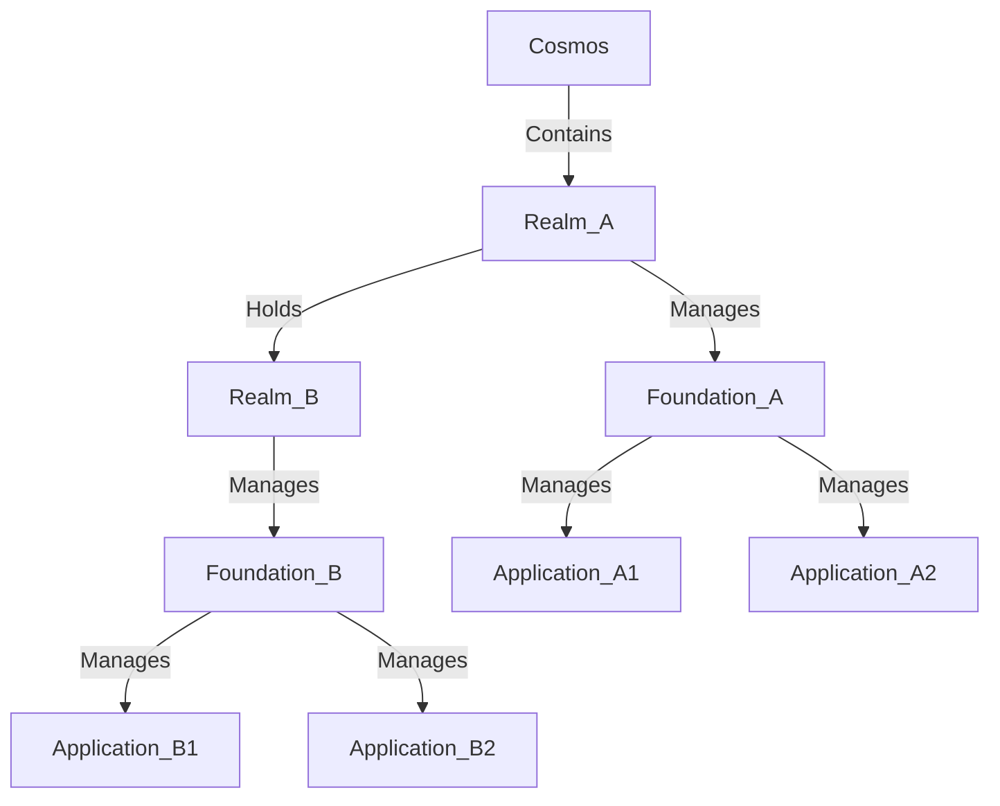
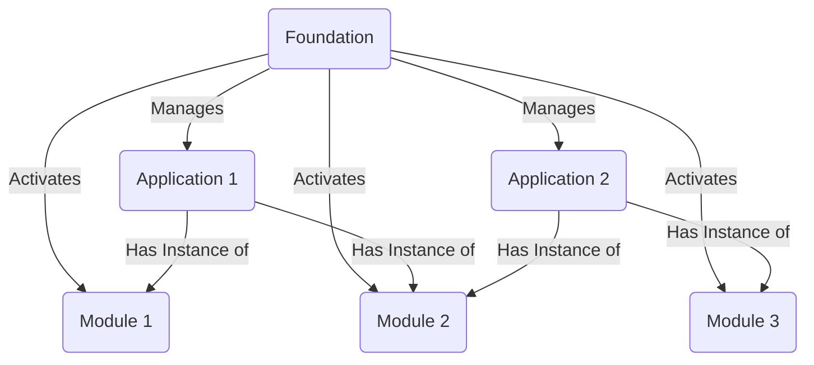
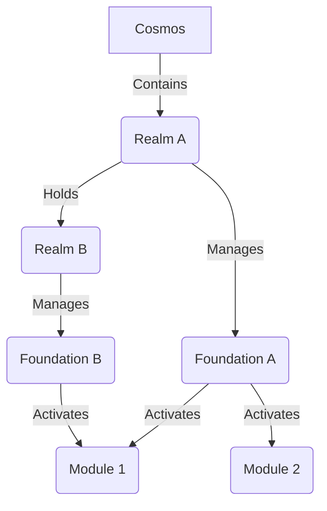

# X-I-A Framework
## Introduction
* Abstraction of Devops level by using configuration files
* A routine to less code or code less
* Describing business needs instead of technical details

## Main component relationships
1. Cosmos is the root component
2. Realm represents a directory-like component holds Foundation as file-like objects
3. Foundation represents a socle on which application should run on

Remark: Foundation, realm or cosmos are nothing but a special application

## Foundation - Application - Module Design
1. All application is installed on a foundation
2. Each application could have instance of modules
3. Before module is usable in each application, they must be enabled in foundation

## Cosmos - Realm - Foundation - Module Design
The same relationship is also defined between Cosmos/Realm and Application
1. All foundation is installed on a realm or cosmos
2. Each foundation could have instance of modules
3. Before module is usable in each foundation, they must be enabled in their manager realm

## Git Integration
Generally, there types of git repository are used:
* Cosmos Git Repository
  * Defining Cosmos - Realm - Foundation structure
  * Activating modules to be used at Foundation level
  * Initializing modules to be used
* Foundation Git Repository
  * Defining Foundation - Application structure
  * Activating modules to be used at Application level
  * Initializing modules to be used
* Application Git Repository
  * Initializing modules to be used

## CLI/UI/Devops Design
Basic activities contains three action parts:
* Activate module 
* Initialize module
* CI/CD 

Basic ways to activate changes
* `make` commands
  * `make activate-module`: activate module
  * `make init-module`: initialize module
  * `make plan`: terraform plan
  * `make apply`: terraform apply
* CI/CD triggered by Git repository

## Configuration files:
### Common configuration files
* `modules.yaml`: 
  * Module class location
  * Activation scope and parameters
  * Deployment scope and parameters
  * Dependencies
* `packages.yaml`: Where the module of which package should be installed
* `landscape.yaml`: relationships among cosmos, realm, foundation and application
  * Cosmos repository
    * tree structure from cosmos to foundation
  * Foundation repository
    * related cosmos, realm information
    * environments and related ci/cd trigger
  * Application repository
    * environments and related ci/cd stage configurations
### Module related configuration files
Module related configuration files should be placed with subdirectories. For example:
* /core: Git, Terraform related
* /platform: GCP, AWS, Azure organization level objects

## Example
### Use case 1: Google Cloud Platform with GitHub
GCP + GitHub with GCS as terraform state file storage is a common case
* Cosmos
  * init modules: The module represents structure of cosmos
    * gcp-module-organization: realm/foundation will be installed as folders
    * gh-module-foundation: creation of a GitHub repository for each foundation
    * gcs-terraform: possible to deploy cosmos landscape
    * module-foundation-state-gcs: place to save foundation tf files
  * activate modules: Enable foundation capacities
    * module-application-state-gcs: possible to create tf file for application attached to foundation (bucket rights to sa)
    * gcp-module-project: possible to create gcp project under a folder (folder owner rights to sa)
    * gh-module-application: possible to create a GitHub repository under a team (token in the secret of foundation repository)
* Foundation
  * init module: The module represents structure of foundation
    * gcp-module-project: application will be installed in projects
    * gh-module-application: creation of a GitHub repository for each application
    * module-application-state-gcs: place to save application tf files
  * active module:
    * 
* 
* 
  * Need to define three environments to form dev -> test -> production chain
  * Directory of GCP and with the following module enabled
    * gcp-module-project: GCP Project Handling
      * Each environment relates to a dedicated GCP project
    * gh-module-application: GitHub Repository Handling
      * Each environment relates to a branch / event combination
* Application
  * If application needs a BQ table the following modules should be enabled:
    * module-state-gcs
    * gcp-module-dataset
    * gcp-module-table
  * Both modules should be enabled at foundation level and configured at application level

### Use case 1 extensions
* Foundation
  * Could be based on GCP / AWS / AZure at the same time
  * Could use GitLab
  * Could use other ways to handle state files
* Application
  * Could activate other functionalities

## GCP Foundation Introduction

## Usage

### Preparation

### Starting from scratch
make bigbang

### Foundation Operations
make create

### Module Operations
make init-module module_class=`module_class` package=`package`

### Application Operations
make create-app app_name=`application_name`
