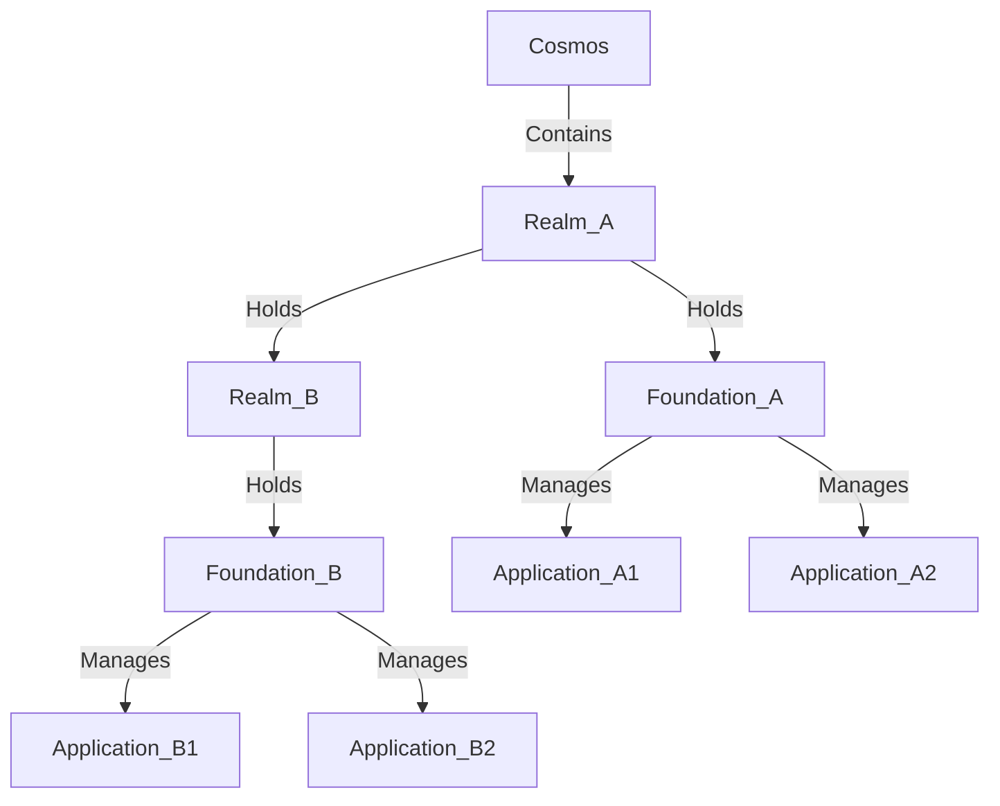
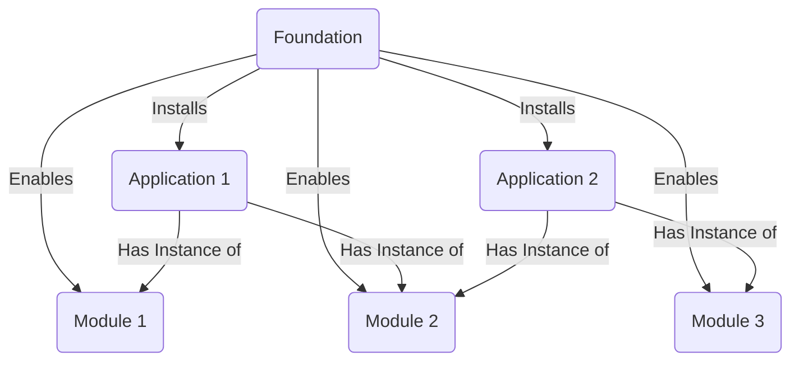

# X-I-A Framework
## Introduction
* Abstraction of Devops level by using configuration files
* A routine to less code or code less
* Describing business needs instead of technical details

## Main component relationships
1. Cosmos is the root component
2. Realm represents a directory-like component holds Foundation as file-like objects
3. Foundation represents a socle on which application should run on

Remark: Foundation, realm or cosmos are nothing but a special application

## Foundation - Application - Module Design
1. All application is installed on a foundation
2. Each application could have instance of modules
3. Before module is usable in each application, they must be enabled in foundation

## Example
### Use case 1: Google Cloud Platform with GitHub
* Cosmos
  * Organization of GCP and GitHub
* Realm
  * Directory of GCP and nothing relates at GitHub side
* Foundation
  * Need to define three environments to form dev -> test -> production chain
  * Directory of GCP and with the following module enabled
    * gcp-module-project: GCP Project Handling
      * Each environment relates to a dedicated GCP project
    * gh-module-application: GitHub Repository Handling
      * Each environment relates to a branch / event combination
* Application
  * If application needs a BQ table the following modules should be enabled:
    * module-state-gcs
    * gcp-module-dataset
    * gcp-module-table
  * Both modules should be enabled at foundation level and configured at application level

### Use case 1 extensions
* Foundation
  * Could be based on GCP / AWS / AZure at the same time
  * Could use GitLab
  * Could use other ways to handle state files
* Application
  * Could activate other functionalities

## GCP Foundation Introduction

## Usage

### Preparation

### Starting from scratch
make bigbang

### Foundation Operations
make create

### Module Operations
make init-module module_class=`module_class` package=`package`

### Application Operations
make create-app app_name=`application_name`
